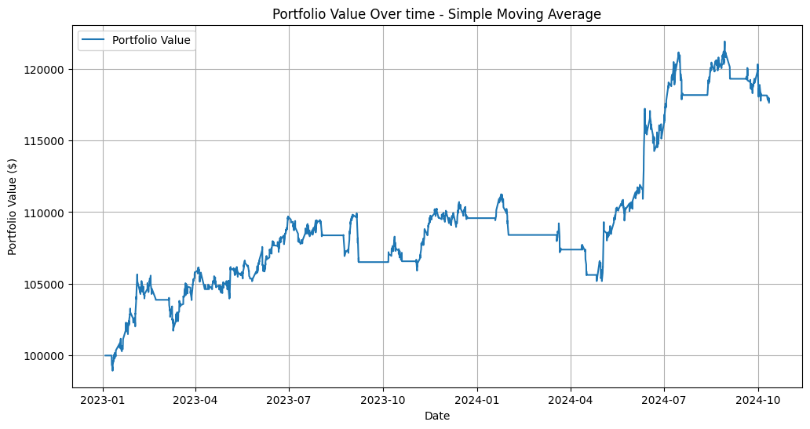
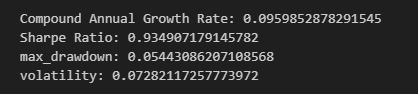
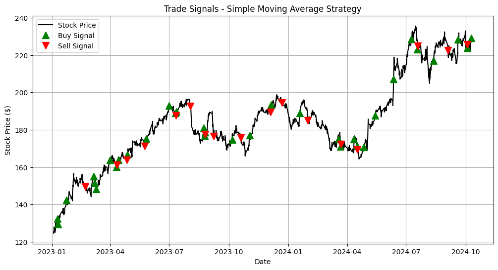

# Algorithmic Trading with Machine Learning

This project explores algorithmic trading using traditional strategies and machine learning models to predict market movements and execute trades. It combines statistical methods, financial indicators, and machine learning to build and evaluate trading strategies.

## **Key Features**
1. **Data Collection and Preprocessing**
    - Collected historical stock data (both hourly and daily) from reliable sources (e.g., Yahoo Finance).
    - Preprocessed the raw data to handle:
        - Missing values and inconsistencies.
        - Feature generation for technical indicators like SMA, RSI, and Bollinger Bands.
        - Normalization and scaling to prepare data for machine learning models.
    - Enhanced preprocessing to support multi-class buy/sell/hold labels dynamically for machine learning compatibility.
    - Saved the processed data for backtesting and training machine learning models.

2. **Backtesting Framework**:
   - Tracks portfolio value, holdings, transaction costs, and slippage.
   - Simulates realistic trading scenarios over historical data.

3. **Implemented Trading Strategies**:
   - **SMA Crossover**:
     - Uses short- and long-term moving averages to identify trend-following opportunities.
   - **Mean Reversion**:
     - Utilizes Bollinger Bands to identify overbought/oversold conditions for reversal trades.
   - **MACD (Moving Average Convergence Divergence)**:
     - Momentum-based strategy leveraging MACD line and Signal line crossovers.

4. **Machine Learning Models**:
   - **Random Forest Classifier**:
     - Predicts buy/sell/hold signals based on engineered features like technical indicators.
     - Includes cross-validation to ensure robust evaluation.
     - Supports per-class accuracy evaluation for buy and sell signals to address class imbalance.
   - **GRU (Gated Recurrent Unit)**:
     - Advanced recurrent neural network for sequential data analysis.
     - Dynamically adjusts to input size and class labels directly from the dataset.
     - Includes bidirectional GRU layers, dropout, and batch normalization for enhanced performance.
     - Predicts buy/sell/hold signals using a rich feature set derived from market data.

5. **Performance Metrics**:
   - **Sharpe Ratio**: Measures risk-adjusted returns.
   - **CAGR**: Compound Annual Growth Rate of the portfolio.
   - **Max Drawdown**: Biggest peak-to-trough loss in portfolio value.
   - **Volatility**: Quantifies the variability in portfolio returns.
   - **Per-Class Metrics**: Precision, recall, and F1-score for buy/sell/hold signals.

6. **Visualizations**:
   - Portfolio value over time with buy/sell markers.
   - Table showing key performance metrics.
   - Trade signals overlaid on stock price graphs.

---

## **Example Visualization**
*Graph displaying Portfolio value over time for the SMA Crossover strategy*

*Table showcasing key performance metrics for SMA Crossover*

*Highlighting buy and sell actions generated by the SMA Crossover strategy along stock price graph*

---

## **Tech Stack**
- **Python**
- **Libraries**:
  - `pandas`, `numpy`: Data handling and manipulation.
  - `matplotlib`, `seaborn`: Visualization.
  - `scikit-learn`: Machine learning models and evaluation.
  - `ta`: Technical indicators for feature engineering.
  - `torch`: GRU implementation and deep learning.
